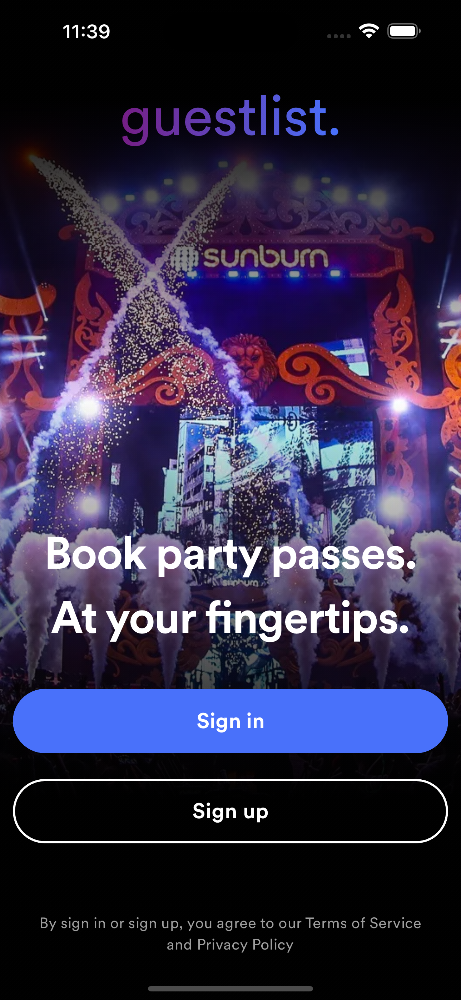
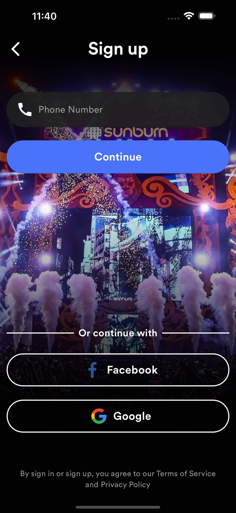
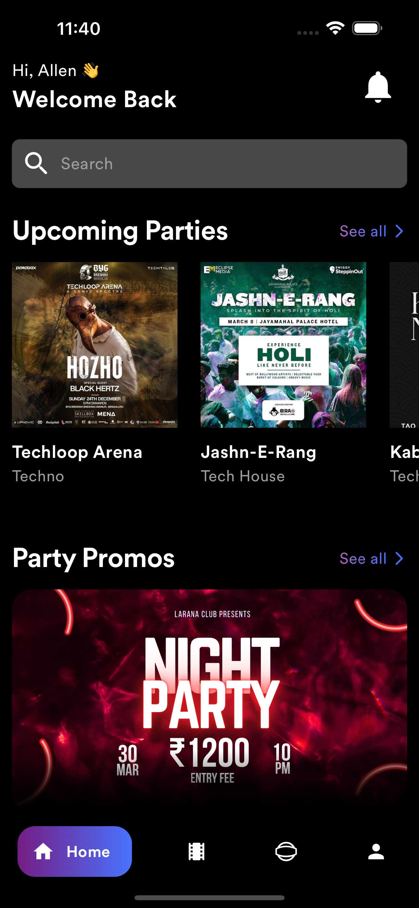
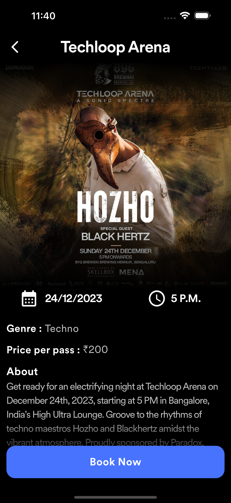
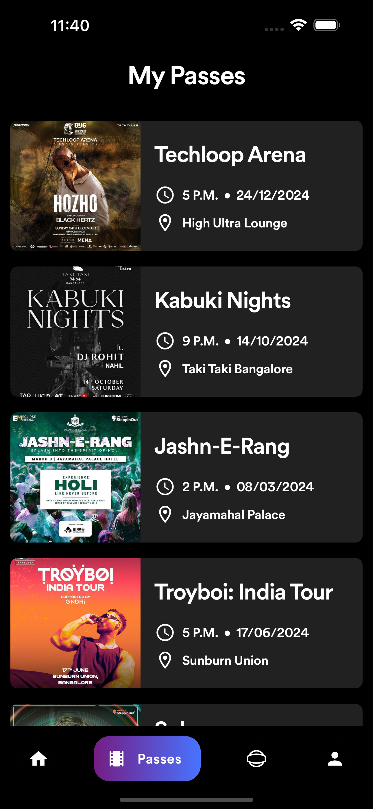
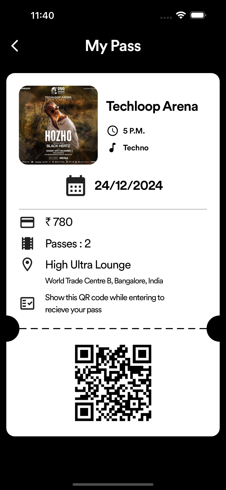
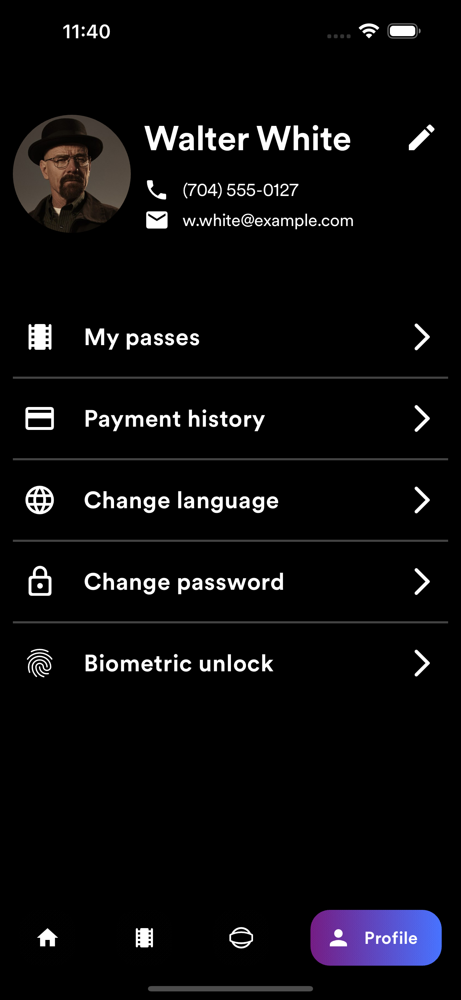

# Guestlist

Guestlist is a party booking app built using Flutter. It provides users with an intuitive platform to book parties, view promotional offers, and stay updated with the latest party news.

The development is still under progress and I am still working on finishing the UI.

I am using Dart, particularly the Flutter framework for the frontend, and will be using Firebase for the backend later on. For the payment gateway I will be integrating RazorPay's API further.

## Features

- **Party Booking:** Users can easily book parties at various venues with just a few taps.
- **Party Promos:** Stay updated with the latest promotional offers and discounts on party bookings.
- **Party News:** Get the latest news and updates about parties and events happening around you.

## Screenshots

### Welcome Screen


### Signup Screen


### Home Screen


### Party Details Screen 1


### Party Details Screen 2


### My Parties Screen


### Party Pass Screen


### Profile Screen



## Installation

To get started with Guestlist, follow these steps:

1. **Clone the repository:**

    ```sh
    git clone https://github.com/quicksilver812/guestlist.git
    ```

2. **Navigate to the project directory:**

    ```sh
    cd guestlist
    ```

3. **Install dependencies:**

    ```sh
    flutter pub get
    ```

4. **Run the app:**

    ```sh
    flutter run
    ```

## Requirements

- Flutter SDK: [Install Flutter](https://flutter.dev/docs/get-started/install)
- Dart SDK (comes with Flutter)
- A device or emulator to run the app

## License

This project is licensed under the MIT License - see the [LICENSE](LICENSE) file for details.

*Thank you*
